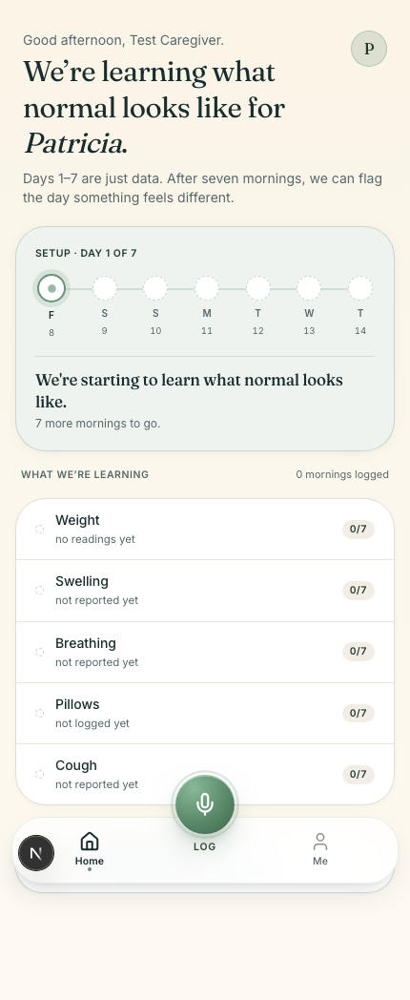
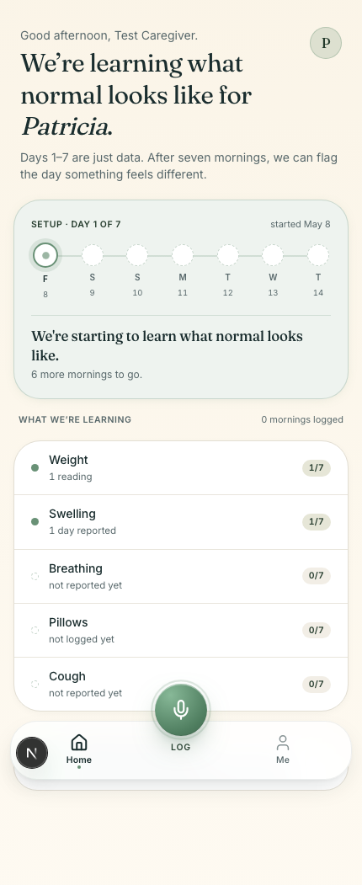
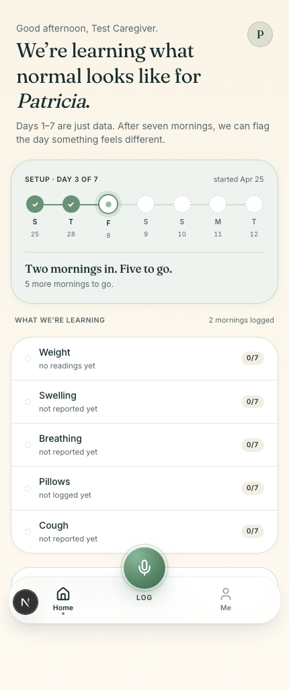
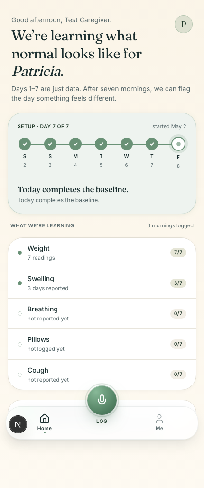
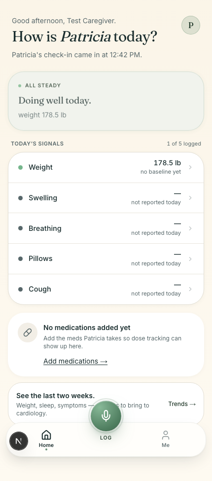
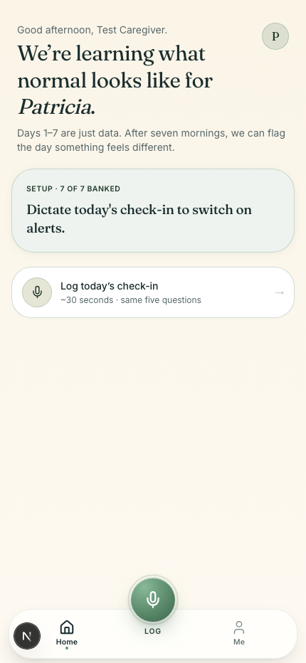
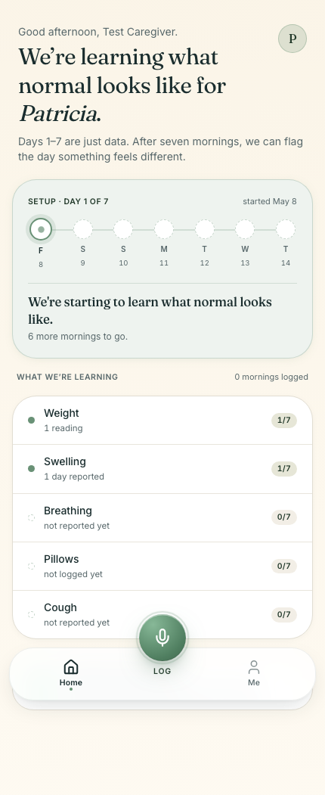
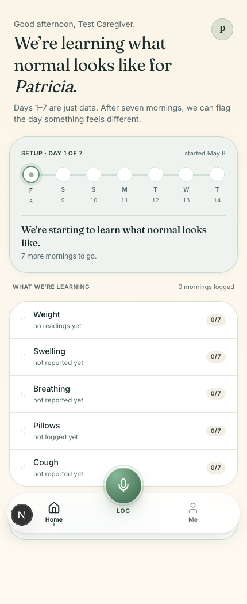
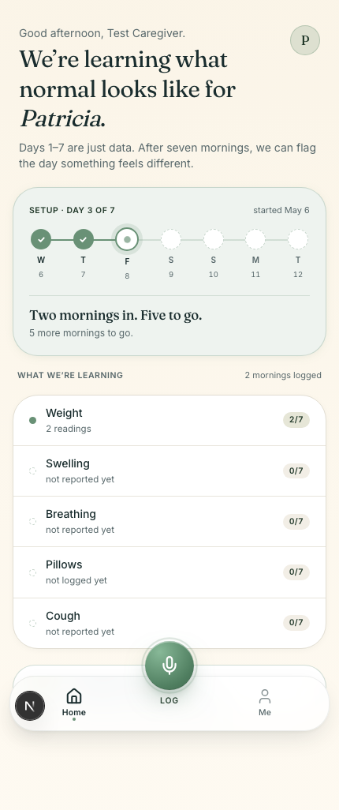
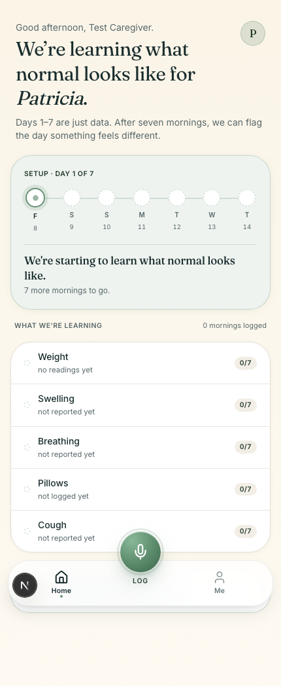

# Baseline progress card — edge-case audit (2026-05-08)

> Plan: `docs/superpowers/plans/2026-05-08-baseline-edge-cases.md`
> Branch: `design-system-alignment`
> Harness: `scripts/seed-baseline-cases.ts` + `tests/baseline-edge-cases.spec.ts` (Playwright + Chromium against the local dev server, signed in as `test-baseline@heartnote.local`).
> Screenshots: `docs/audits/baseline-screenshots/case-N.png`

## Summary

Ten plan cases walked end-to-end on real Supabase rows (Case 5 walked twice — once before the engine writes its assessment, once after — to verify the cold-start exit). All eleven spec rows pass after fixes. Two narrow bugs the plan flagged ahead of time were confirmed in the first walk and fixed in `BaselineProgressCard.tsx`:

1. **Case 4** — when the bank effectively reset (no logs in 14-day window, but the patient logged once weeks ago), the card now reads `Setup · day 1 of 7 · restarted today` and suppresses the stale `started Apr 16` footer. The asymmetric "day 1 of 7 · started 22 days ago" reading is gone.
2. **Case 6** — when the bank is already at or past 7 distinct days but a stale `cold_start = true` assessment forces the cold-start branch, the 7-dot track is replaced with a `Setup · 7 of 7 banked` prompt that invites today's log. The bug where `banked[6]` silently disappeared because slot 7 collided with the today-pulse is closed. The eyebrow stays in the "Setup ·" register so it doesn't collide with the dashboard's still-learning header above the card — alerts only switch on once the engine writes `cold_start=false`.

No clinical thresholds, alert engine logic, or RLS policies changed. Pure render-side defensive branches.

## Per-case verdicts

### Case 1 — fresh account, 0 logs ever
**Seed:** no `daily_logs` rows. Patient created today.
**Render:** `Setup · day 1 of 7`, eyebrow right reads `started May 8`, today (F 8) is the pulse-outline dot, all 5 collecting rows show `0/7`.
**Verdict:** PASS. 

### Case 2 — logged today only
**Seed:** one `daily_logs` row for today, complete; weight reading; swelling event.
**Render:** `Setup · day 1 of 7`, today filled (sage check), `We're starting to learn what normal looks like.`, footer `6 more mornings to go.`. Weight count `1/7`, Swelling count `1/7`, others `0/7`.
**Verdict:** PASS. 

### Case 3 — 2 logs in window, today not logged
**Seed:** logs at `today-13` and `today-10`. No log today.
**Render:** `Setup · day 3 of 7`, dots at -13 and -10 filled, today is pulse-outline at slot 3, `Two mornings in. Five to go.`, footer `5 more mornings to go.`.
**Verdict:** PASS. 

### Case 4 — 2 logs ~3 weeks ago (outside window)
**Seed:** logs at `today-22` and `today-21`. Both outside the 14-day baseline window.
**Pre-fix render:** Eyebrow `Setup · day 1 of 7`, footer `started Apr 16` — asymmetric: bank shows zero progress but the footer reads as if the patient is 22 days into baseline.
**Post-fix render:** `Setup · day 1 of 7 · restarted today`. The stale `started Apr 16` line is suppressed when the bank is empty AND `startedAt !== today`.
**Verdict:** PASS after fix. The asymmetric framing is gone; the card honestly says "the bank just restarted." 

### Case 5 — 6 prior logs + today completes the baseline
**Seed:** 6 logs at `today-6 .. today-1` plus today's log (complete). No `daily_assessments` row yet (engine hasn't run).
**Render:** `Setup · day 7 of 7`, all 7 dots filled, headline `Today completes the baseline.`, footer `Today completes the baseline.`. Weight count `7/7`.
**Verdict:** PASS. 

### Case 5b — same patient after the engine wrote cold_start=false
**Seed:** identical to Case 5, plus a `daily_assessments` row for today with `tier=tier_4_log` and `cold_start=false`.
**Render:** `BaselineProgressCard` is NOT rendered. The dashboard moves into the post-baseline branch.
**Verdict:** PASS. The cold-start exit fires the moment the engine writes its verdict. 

### Case 6 — 7 logs across 14 days with gaps + race-seeded cold_start
**Seed:** logs at `today-13, -11, -9, -7, -5, -3, -1` plus a `daily_assessments` row for today with `cold_start=true`. The race condition the plan flagged: bank already has 7 distinct days, but the assessment forces the cold-start branch.
**Pre-fix render:** Eyebrow `Setup · day 7 of 7`, six sage-checked dots, today's pulse at slot 7. The 7th banked day (the most recent one before today) is silently absent from the visualization — slot 7 is the today-pulse, not `banked[6]`.
**Post-fix render:** Compact card with eyebrow `Setup · 7 of 7 banked` and body `Dictate today's check-in to switch on alerts.` — no 7-dot track at all.
**Verdict:** PASS after fix. The dropped-day bug is closed. 

### Case 7 — today logged twice (multiple dictations same calendar day)
**Seed:** two `daily_logs` rows for today, both complete.
**Render:** identical to Case 2. The `Set` dedup on `loggedDates` collapses the two rows to one banked-today.
**Verdict:** PASS. 

### Case 8 — today's log is pending (mid-recording)
**Seed:** one `daily_logs` row for today with `processing_status=pending`, no transcript.
**Render:** Dashboard treats today as `logStatus='none'`. Today excluded from `loggedDatesForCard`. Eyebrow `Setup · day 1 of 7`, today is pulse-outline (no check), footer `7 more mornings to go.`.
**Verdict:** PASS. The card honors the engine contract: pending ≠ banked. 

### Case 9 — patient TZ math (sanity)
**Seed:** identical shape to Case 3. The patient is in `America/Los_Angeles`; the dashboard derives `today` from `getTodayInTimezone(profile.timezone)`, not server UTC.
**Render:** `Setup · day 3 of 7`. Dot dates and today's pulse anchor on the patient-local date.
**Verdict:** PASS for the snapshot. The midnight-boundary live behavior (11:50 PM PST → 12:10 AM PST shows day-rollover) is a code-review check on `getTodayInTimezone`, not a runtime assertion — confirmed by reading `src/lib/dates/today.ts` and `src/app/dashboard/page.tsx` line 53. 

### Case 10 — patient existed for 60 days, no logs since
**Seed:** the test patient row already exists from earlier cases. No `daily_logs` rows after reset.
**Render:** `getBaselineWindow` returns `loggedDates=[]` and `startedAt=today` (because `firstQ` finds no log row). Card renders identical to Case 1 — fresh-start framing, no false "60 days into baseline" implication.
**Verdict:** PASS. The fresh-start fallback is correct. 

## Code changes

### `src/components/heartnote/BaselineProgressCard.tsx` + `src/app/dashboard/page.tsx`

1. **Defensive `BaselineCompleteCard` branch** at the top of `BaselineProgressCard`. Fires when `daysBanked >= COLD_START_MIN_LOG_DAYS`. Skips the 7-dot track entirely; renders a compact sage card prompting today's log. Closes Case 6.
2. **`bankRestarted` flag** computed from `daysBanked === 0 && firstLoggedDate !== null && firstLoggedDate !== today`. When true, the eyebrow appends ` · restarted today` and the right-side `started X` footer is suppressed. Closes Case 4.
3. **Prop rename `startedAt: string` → `firstLoggedDate: string | null`.** The old prop coerced "no logs ever" and "first log was today" into the same value (today's ISO date), which made the `bankRestarted` invariant fragile against future changes that backed `startedAt` with `patients.created_at`. The component now treats null explicitly: a brand-new patient with no logs reads as fresh-start, never as "restarted." `getBaselineWindow` in the dashboard returns `firstLoggedDate: null` when `firstQ` finds no row.

No changes to clinical thresholds (`src/lib/clinical/thresholds.ts`), the alert engine (`src/lib/alerts/`), or the dashboard's cold-start gate logic. The fixes are render-side only.

### `src/components/heartnote/BaselineProgressCard.tsx` (test id)
Added `data-testid="baseline-progress-card"` to the outer `<section>` so Playwright can scope element-level lookups.

### Test infrastructure

- `scripts/seed-baseline-cases.ts` — seeds the test caregiver's data per case.
- `scripts/baseline-test-fixtures.ts` — shared constants (test email, password).
- `tests/global-setup.ts` — generates a Supabase magic-link via service role, redeems it through `/auth/callback` in a real browser, verifies the captured session resolves `/dashboard`, stashes `tests/.auth/baseline-caregiver.json`.
- `tests/baseline-edge-cases.spec.ts` — one Playwright test per case.
- `playwright.config.ts` — targets `https://localhost:3001`, `ignoreHTTPSErrors`, single worker, reuses the captured storage state across cases.

`@playwright/test` added as a `devDependency`. Chromium is the only browser installed.

## Open design questions surfaced during the walk

None new. The plan's recommended Case 4 framing (option b — bury the stale "started" line, surface "restarted today" instead) was implemented as recommended. If the user prefers option (a) — keeping the stale-but-accurate "started Apr 16" line — flip `bankRestarted` to always `false` and the prior render returns.

## Limits of this audit

- **Case 9** confirms the snapshot but does not exercise an actual midnight rollover. Reproducing that requires a TZ-shifting test harness; the function under test (`getTodayInTimezone`) is small and was code-reviewed inline.
- The audit verifies render correctness, not the alert engine itself. Engine rules (T1.x / T2.x / T3.x) are out of scope per the plan's "What this plan does NOT do" section.
- Screenshots are rendered against the dev server, not the production Vercel preview. Visual differences should be cosmetic only (font loading, etc.).
